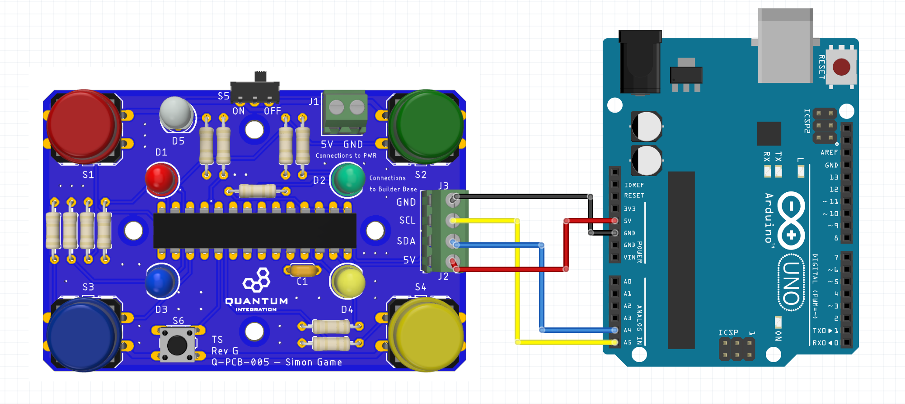

# Example for Arduino usage
## Prerequisites

To build the code for Arduino, we use this [library](https://github.com/adafruit/Adafruit-MCP23017-Arduino-Library) from [Adafruit](https://www.adafruit.com/). A tutorial on how to add the library to your Arduino IDE can be found [here](https://www.arduino.cc/en/guide/libraries).

## Usage

Simply follow the connection diagram below and you can start playing the Simon Game!

